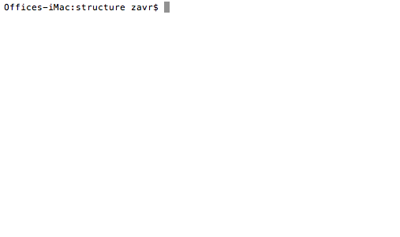

# bestie

[](https://npmjs.org/package/bestie)

`bestie` is a Node.js package to build Node.js packages with `import` and `export` statements. The goal of this project is to start with using the babel AST parsing to build packages to allow functionality, however then to implement a regular expression transform stream which would update references to `import` into `require` statements. The motivation for this is that a modern Node.js package would only need a single babel transform to allow imports and exports, however all babel dependencies need to be installed and linked (around 5500 dependencies). Also, when transpiling, babel transform will use `requireInterop` expression which VS Code IDE cannot parse, and the JSDoc documentation disappears from all functions _etc_ not exported in the main file.

```sh
yarn add -DE bestie
```

## Table Of Contents

- [Table Of Contents](#table-of-contents)
  * [CLI](#cli)
    * [`install bestie`](#install-bestie)
    * [`package.json`](#packagejson)
    * [`--init`, `-i`: Init .Babelrc](#--init--i-init-babelrc)
    * [`--help`, `-h`: Show Help](#--help--h-show-help)
    * [`b [src] [--out-dir=build]`: Build Project](#b-src---out-dirbuild-build-project)
    * [`bestie -e .`: Print `Node_modules` Size](#bestie--e--print-node_modules-size)
    * [`bestie -I`: Install `@Babel`](#bestie--i-install-babel)
      * [<code>b -I</code> log](#codeb--icode-log)
    * [`bestie -U`: Uninstall `@Babel`](#bestie--u-uninstall-babel)
- [API](#api)
  * [`async bestie(config: object)`](#async-bestieconfig-from-string--srcto-string--buildargs-string--stdout-stream--processstdoutstderr-stream--processstderrcwd-string--processcwd-void)
- [How To Reduce The Size Of Node_modules](#how-to-reduce-the-size-of-node_modules)

### CLI

To <a name="install-bestie">`install bestie`</a>, you need to clone its repository in the working directory, and install it with the dev dependencies from there. Then, `yarn link` it, and again in other projects.

```sh
cd ~/work
git clone https://github.com/artdecocode/bestie.git
cd bestie
yarn
link
cd ..
cd project
yarn link bestie
```

Because the all dependencies that the babel needs are in the bestie directory, they will be used. No need to install them for each individual project.

The usage via the CLI is encouraged and can be achieved by specifying a `script` field in the <a name="packagejson">`package.json`</a> file, e.g.,

```json
{
  "name": "package",
  "scripts": {
    "build": "b"
  },
  "dependencies": {
    "bestie": "2.0.0"
  }
}
```

#### `--init`, `-i`: Init .Babelrc

Create a `.babelrc` file in the current direcory. The default content is:

```json
{
  "plugins": [
    "@babel/plugin-syntax-object-rest-spread",
    "@babel/plugin-transform-modules-commonjs"
  ],
  "env": {
    "test-build": {
      "plugins": [
        [
          "transform-rename-import",
          {
            "original": "^((../)+)src",
            "replacement": "$1build"
          }
        ]
      ],
      "ignore": [
        "build/**/*.js"
      ]
    },
    "debug": {
      "retainLines": true
    }
  }
}
```

#### `--help`, `-h`: Show Help

```sh
A command-line tool to build packages.
  Source is the first argument, followed by any additional arguments
  Default source is src and default out-dir is build.
  Any other additional arguments are passed along to babel.


  bestie [src] [--out-dir build] [[--copy-files] --etc] | -iIU

	--help, -h     	Print the help message.
	--init, -i     	Write the .babelrc in the current directory.
	--install, -I  	Add @babel dependencies.
	--uninstall, -U	Remove @babel dependencies from the current directory.

  Example:

    bestie src --out-dir build --copy-files
```

#### `b [src] [--out-dir=build]`: Build Project

The `b` binary will build the project, taking the files from the `src` directory and transpiling them into files in the `out-dir`.

#### `bestie -e .`: Print `Node_modules` Size

When installed globally, `bestie` can report the size of `node_modules` directory with `-e` command. The size is got from the `du` command. It might differ from the `du -sh ./*/node_modules` report.

```sh
rel                    size    
idio-dev               146.3 MB
artdeco.bz             143.8 MB
idio                   83.5 MB 
rqt                    65.6 MB 
koa2-jsx               54.2 MB 
adc.sh                 45.5 MB 
appshot                24.7 MB 
mnp                    10 MB   
documentary            9.3 MB  
pedantry               8 MB    
assert-throws          7.9 MB  
africa                 7.4 MB  
restream               7.4 MB  
expensive              7.1 MB  
usually                7.1 MB  
erte                   7.1 MB  
tablature              7.1 MB  
bosom                  7.1 MB  
zoroaster              7.1 MB  
snapshot-context       7 MB    
argufy                 6.4 MB  
makepromise            6.3 MB  
reloquent              6.1 MB  
erotic                 5.8 MB  
pompeii                5.6 MB  
ictx                   5.6 MB  
window-info            5.6 MB  
irio                   5.6 MB  
nodeeu                 5.6 MB  
aqt                    5.6 MB  
spawncommand           4.7 MB  
eslint-config-artdeco  4.6 MB  
yarn-s                 4.6 MB  
mnp-idio               4.6 MB  
mnp-irio               0 MB
```

#### `bestie -I`: Install `@Babel`

Installs the modules in the list below in the current package directory with the latest version.

```fs
@babel/cli
@babel/core
@babel/register
@babel/plugin-syntax-object-rest-spread
@babel/plugin-transform-modules-commonjs
babel-plugin-transform-rename-import
```

<details>
  <summary><a name="codeb--icode-log"><code>b -I</code> log</a></summary>

```c
Offices-iMac:structure zavr$ yarn bI
yarn run v1.7.0
$ b -I
[1/4] Resolving packages...
[2/4] Fetching packages...
[3/4] Linking dependencies...
[4/4] Building fresh packages...
success Saved lockfile.
success Saved 134 new dependencies.
info Direct dependencies
├─ @babel/cli@7.0.0-beta.51
├─ @babel/core@7.0.0-beta.51
├─ @babel/plugin-syntax-object-rest-spread@7.0.0-beta.51
├─ @babel/plugin-transform-modules-commonjs@7.0.0-beta.51
├─ @babel/register@7.0.0-beta.51
└─ babel-plugin-transform-rename-import@2.2.0
info All dependencies
├─ @babel/cli@7.0.0-beta.51
├─ @babel/core@7.0.0-beta.51
├─ @babel/helper-function-name@7.0.0-beta.51
├─ @babel/helper-get-function-arity@7.0.0-beta.51
├─ @babel/helper-module-imports@7.0.0-beta.51
├─ @babel/helper-module-transforms@7.0.0-beta.51
├─ @babel/helpers@7.0.0-beta.51
├─ @babel/highlight@7.0.0-beta.51
├─ @babel/plugin-syntax-object-rest-spread@7.0.0-beta.51
├─ @babel/plugin-transform-modules-commonjs@7.0.0-beta.51
├─ @babel/register@7.0.0-beta.51
├─ abbrev@1.1.1
├─ anymatch@2.0.0
├─ aproba@1.2.0
├─ are-we-there-yet@1.1.5
├─ arr-flatten@1.1.0
├─ assign-symbols@1.0.0
├─ async-each@1.0.1
├─ atob@2.1.1
├─ babel-plugin-transform-rename-import@2.2.0
├─ base@0.11.2
├─ binary-extensions@1.11.0
├─ braces@2.3.2
├─ cache-base@1.0.1
├─ chokidar@2.0.4
├─ chownr@1.0.1
├─ class-utils@0.3.6
├─ code-point-at@1.1.0
├─ collection-visit@1.0.0
├─ commander@2.15.1
├─ commondir@1.0.1
├─ console-control-strings@1.1.0
├─ copy-descriptor@0.1.1
├─ core-js@2.5.7
├─ debug@2.6.9
├─ decode-uri-component@0.2.0
├─ deep-extend@0.6.0
├─ delegates@1.0.0
├─ detect-libc@1.0.3
├─ expand-brackets@2.1.4
├─ extglob@2.0.4
├─ fill-range@4.0.0
├─ find-cache-dir@1.0.0
├─ find-up@2.1.0
├─ for-in@1.0.2
├─ fs-minipass@1.2.5
├─ fs-readdir-recursive@1.1.0
├─ fsevents@1.2.4
├─ gauge@2.7.4
├─ get-value@2.0.6
├─ glob-parent@3.1.0
├─ has-unicode@2.0.1
├─ has-value@1.0.0
├─ has-values@1.0.0
├─ home-or-tmp@3.0.0
├─ ignore-walk@3.0.1
├─ ini@1.3.5
├─ invariant@2.2.4
├─ is-accessor-descriptor@1.0.0
├─ is-binary-path@1.0.1
├─ is-data-descriptor@1.0.0
├─ is-descriptor@1.0.2
├─ is-extglob@2.1.1
├─ is-glob@4.0.0
├─ is-odd@2.0.0
├─ is-plain-obj@1.1.0
├─ is-plain-object@2.0.4
├─ is-windows@1.0.2
├─ jsesc@2.5.1
├─ json5@0.5.1
├─ kind-of@3.2.2
├─ locate-path@2.0.0
├─ lodash.debounce@4.0.8
├─ loose-envify@1.3.1
├─ make-dir@1.3.0
├─ map-visit@1.0.0
├─ micromatch@3.1.10
├─ minizlib@1.1.0
├─ mixin-deep@1.3.1
├─ nan@2.10.0
├─ nanomatch@1.2.9
├─ needle@2.2.1
├─ node-modules-regexp@1.0.0
├─ node-pre-gyp@0.10.2
├─ nopt@4.0.1
├─ npm-bundled@1.0.3
├─ npm-packlist@1.1.10
├─ npmlog@4.1.2
├─ number-is-nan@1.0.1
├─ object-copy@0.1.0
├─ os-homedir@1.0.2
├─ osenv@0.1.5
├─ output-file-sync@2.0.1
├─ p-limit@1.3.0
├─ p-locate@2.0.0
├─ p-try@1.0.0
├─ pascalcase@0.1.1
├─ path-dirname@1.0.2
├─ path-exists@3.0.0
├─ path-parse@1.0.5
├─ pirates@3.0.2
├─ pkg-dir@2.0.0
├─ posix-character-classes@0.1.1
├─ rc@1.2.8
├─ readdirp@2.1.0
├─ remove-trailing-separator@1.1.0
├─ repeat-element@1.1.2
├─ resolve-url@0.2.1
├─ resolve@1.8.1
├─ ret@0.1.15
├─ sax@1.2.4
├─ set-blocking@2.0.0
├─ set-immediate-shim@1.0.1
├─ set-value@2.0.0
├─ slash@1.0.0
├─ snapdragon-node@2.1.1
├─ snapdragon-util@3.0.1
├─ source-map-resolve@0.5.2
├─ source-map-support@0.4.18
├─ source-map-url@0.4.0
├─ source-map@0.5.7
├─ split-string@3.1.0
├─ static-extend@0.1.2
├─ tar@4.4.4
├─ to-fast-properties@2.0.0
├─ to-regex-range@2.1.1
├─ trim-right@1.0.1
├─ union-value@1.0.0
├─ unset-value@1.0.0
├─ upath@1.1.0
├─ urix@0.1.0
├─ use@3.1.0
├─ wide-align@1.1.3
└─ yallist@3.0.2
✨  Done in 62.53s.
```
</details>

#### `bestie -U`: Uninstall `@Babel`

Removes the modules (from the same list as installed), and will ask for confirmation beforehand:

```c
Continue removing
 @babel/cli@7.0.0-beta.51
 @babel/core@7.0.0-beta.51
 @babel/register@7.0.0-beta.51
 @babel/plugin-syntax-object-rest-spread@7.0.0-beta.51
 @babel/plugin-transform-modules-commonjs@7.0.0-beta.51
 babel-plugin-transform-rename-import@2.2.0
from bestie? [y] n
```

<details>
  <summary><code>b -U</code></summary>
  <table>
  <tr><td>
    
  </td></tr>
  </table>
</details>

## API

`bestie` can also be used programmatically and has the following API.

### `async bestie(`<br/>&nbsp;&nbsp;`config: {`<br/>&nbsp;&nbsp;&nbsp;&nbsp;`from?: string = src,`<br/>&nbsp;&nbsp;&nbsp;&nbsp;`to?: string = build,`<br/>&nbsp;&nbsp;&nbsp;&nbsp;`args?: string[] = [],`<br/>&nbsp;&nbsp;&nbsp;&nbsp;`stdout?: Stream = process.stdout,`<br/>&nbsp;&nbsp;&nbsp;&nbsp;`stderr?: Stream = process.stderr,`<br/>&nbsp;&nbsp;&nbsp;&nbsp;`cwd?: string = process.cwd(),`<br/>&nbsp;&nbsp;`},`<br/>`): void`

Calling the `bestie` function from the source code will return a promise to transpile files. In background, `babel` will be spawned via the `child_process`.

```javascript
import bestie from 'bestie'

(async () => {
  await bestie({
    from: 'src',
    to: 'build',
    args: ['--copy-files', '--include-dotfiles'],
    stdout: process.stdout,
    stderr: process.stderr,
    cwd: process.cwd(),
  })
})()
```

```
node_modules/@babel/cli/bin/babel.js src --out-dir build --copy-files --include-dotfiles 

🎉  Successfully compiled 6 files with Babel.
```

## How To Reduce The Size Of Node_modules

Before upgrading to using `bestie`, a standard package `node_module` directory would occupy ~ 90 MB of disk space, including `@babel/cli`, `@babel/core`, `@babel/register`, `@babel/plugin-syntax-object-rest-spread`, `@babel/plugin-transform-modules-commonjs`, `babel-plugin-transform-rename-import` and `eslint`.

At first, `@babel` was removed, and then `eslint`. This allowed to save 2 GB of disk space in total.

| name | v | size | size2 | size3 | final |
| ---- | - | ---- | ----- | ----- | ----- |
| adc.sh | 7.0.0-beta.46 | 84064 | 46512 | 46512 | x0.8 |
| africa | 7.0.0-beta.51 | 88472 | 46200 | 7608 | x10.6 |
| appshot | 7.0.0-beta.49 | 104088 | 61680 | 25320 | x3.1 |
| aqt | 7.0.0-beta.51 | 124712 | 81040 | 5688 | x20.9 |
| argufy | 7.0.0-beta.51 | 62480 | 6600 | 6600 | x8.4 |
| artdeco.bz | 7.0.0-beta.47 | 197640 | 171032 | 147296 | x0.3 |
| assert-throws | 7.0.0-beta.46 | 60176 | 8064 | 8064 | x6.4 |
| bestie | 7.0.0-beta.51 | 64240 | 64104 | 64120 | x0 |
| bosom | 7.0.0-beta.49 | 90808 | 45840 | 7232 | x11.5 |
| documentary | 7.0.0-beta.51 | 90928 | 46544 | 7936 | x10.4 |
| erotic | 7.0.0-beta.49 | 89192 | 44520 | 5928 | x14 |
| erte | 7.0.0-beta.49 | 90896 | 45840 | 7232 | x11.5 |
| eslint-config-artdeco |  | 4744 | 4744 | 4744 | x0 |
| expensive | 7.0.0-beta.51 | 91320 | 45896 | 7288 | x11.5 |
| ictx | 7.0.0-beta.49 | 89048 | 44296 | 5688 | x14.6 |
| idio | 7.0.0-beta.47 | 155456 | 111288 | 85512 | x0.8 |
| idio-dev | 7.0.0-beta.49 | 198536 | 173016 | 149816 | x0.3 |
| irio | 7.0.0-beta.49 | 89048 | 44296 | 5688 | x14.6 |
| koa2-jsx | 7.0.0-beta.47 | 125520 | 81568 | 55544 | x1.2 |
| makepromise | 7.0.0-beta.46 | 58456 | 6416 | 6416 | x8.1 |
| mnp | 7.0.0-beta.49 | 93176 | 48888 | 10280 | x8 |
| mnp-idio |  | 4720 | 4720 | 4720 | x0 |
| mnp-irio |  | 8 | 8 | 8 | x0 |
| nodeeu | 7.0.0-beta.49 | 89048 | 44296 | 5688 | x14.6 |
| pedantry | 7.0.0-beta.51 | 89800 | 46760 | 8152 | x10 |
| pompeii | 7.0.0-beta.49 | 89048 | 44296 | 5688 | x14.6 |
| reloquent | 7.0.0-beta.49 | 88568 | 44424 | 6296 | x13 |
| restream | 7.0.0-beta.51 | 63144 | 7592 | 7592 | x7.3 |
| rqt | 7.0.0-beta.51 | 173920 | 130864 | 67128 | x1.5 |
| snapshot-context | 7.0.0-beta.47 | 64456 | 7160 | 7160 | x8 |
| spawncommand | 7.0.0-beta.47 | 62264 | 4816 | 4816 | x11.9 |
| tablature | 7.0.0-beta.49 | 90744 | 7232 | 7232 | x11.5 |
| usually | 7.0.0-beta.49 | 90736 | 45840 | 7232 | x11.5 |
| window-info | 7.0.0-beta.49 | 89296 | 44296 | 5688 | x14.6 |
| yarn-s | 7.0.0-beta.46 | 56256 | 4744 | 4744 | x10.8 |
| zoroaster | 7.0.0-beta.47 | 90168 | 45832 | 7224 | x11.4 |
| total |  | 3120 MB | 1671 MB | 801 MB | x3 |

---

(c) [Art Deco Code][1] 2018

[1]: https://adc.sh
